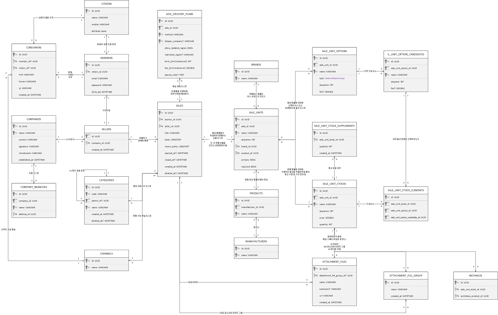
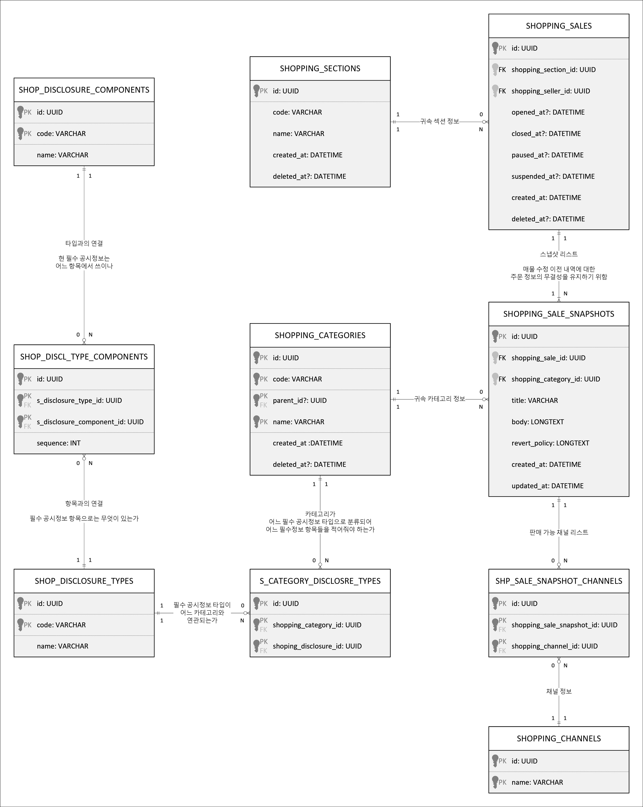
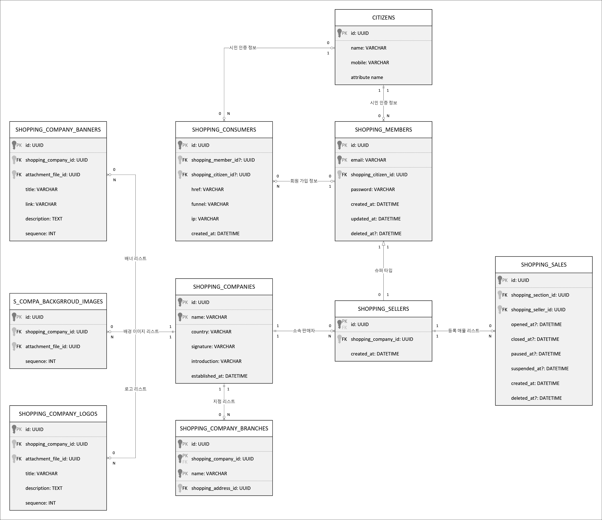

# ERD 해설서

## Sale

### `shopping_sales`

판매자가 등록한 매물 정보.

`ShoppingSale` 은 [판매자](#shopping_sellers)가 특정 [섹션](#shopping_sections) 에 등록한 매물을 형상화한 엔티티이다.

다만, 이 매물이 곧장 판매 제품 [Product](#products) 와 1: 1 로 이어지는 것은 아니다. 도리어 하나의 매물에서 복수의 [Product](#products) 를 동시에 판매할 수 있도록 설계되어있다. 이에 관련해서는 [ShoppingSaleSnapshotUnit](#shopping_sale_snapshot_units) 에 자세히 서술해두었다.

그리고 `ShoppingSale` 의 판매 제품 및 컨텐츠 정보들은 모두, [shopping_sale_snapshots](#shopping_sale_snapshots) 라 하여, 1: N 관계를 가지는 하위 엔티티에 기록된다. 이는 앞서 본 [bbs_articles](#bbs_articles) 와 [bbs_article_contents](#bbs_article_contents) 의 경우와 같아, [판매자](#shopping_sellers)가 기 등록하여 판매가 개시된 매물 정보를 편집하면, 기존의 `ShoppingSale` 레코드를 변경하는 것이 아니라, [ShoppingSaleSnapshot](#shopping_sale_snapshots) 를 새로이 생성하게 되는 것이다.

이는 고객이 특정 매물을 구입한 이후에 판매자가 해당 매물의 구성품이나 가격 등을 변경하더라도, 고객이 구매한 당시의 매물 내역을 보존하기 위함이다. 즉, 고객의 구매 내역을 영구히 보존하고 무결성을 유지하기 위하여, `ShoppingSale` 로부터 [shopping_sale_snapshots](#shopping_sale_snapshots) 를 분리해 낸 것이다.

- Properties
  - `id`
  - `shopping_section_id`: 귀속 섹션의 [ShoppingSection.id](#shopping_sections)
  - `shopping_seller_id`: 판매자의 [ShoppingSeller.id](#shopping_sellers)
  - `created_at`: 레코드 생성 일시
  - `opened_at`: 판매 개시 일시
  - `closed_at`: 판매 종료 일시
  - `paused_at`: 판매 일시 중단 일시
  - `suspended_at`: 전시 및 판매 중단 일시

### `shopping_sale_snapshots`

> 자료구조 상에는 나타나지 않는 엔티티, 그냥 [IShoppingSale](../src/api/structures/shoppings/sales/IShoppingSale.ts) 과 동일시 할 것

판매자가 등록한 매물의 스냅샷 정보.

`ShoppingSaleSnapshot` 은 [매물](#shopping_sales)의 스냅샷을 형상화한 엔티티로써, 새 [매물](#shopping_sales)을 생성하거나 혹은, 판매 중인 기존의 [매물](#shopping_sales)을 수정할 때마다 새 레코드가 생성된다. 단, 판매자가 매물을 수정하였다하여 반드시 새 스냅샷 레코드가 생성되는 것은 아니다. 만일 해당 매물이 아직 판매 개시되지 않았다면, 기존 매물의 마지막 스냅샷을 수정하는 것으로 그칠 뿐이다.

그리고 이처럼 [ShoppingSale](#shopping_sales) 로부터 `ShoppingSaleSnapshot` 이 1: N 관계로 분리된 이유는, 고객이 특정 [매물](#shopping_sales)을 구입한 이후에 판매자가 해당 [매물](#shopping_sales)의 구성품이나 가격 등을 변경하더라도, 고객이 구매한 당시의 [매물](#shopping_sales) 내역을 영구히 보존하여 무결성을 유지하기 위함이다.

더하여 `ShoppingSaleSnapshot` 를 잘 활용하면, 판매자는 이를 통하여 AB 테스트를 수행해 볼 수 있다. [매물](#shopping_sales)의 구성품이나 가격 등을 바꾸어가며, 각각의 스냅샷 별 통계정보를 보며 성과를 측정하고, 이를 통하여 시장의 반응을 이해할 수 있는 것이다.

- Properties
  - `id`
  - `shopping_sale_id`: 귀속 매물의 [ShoppingSale.id](#shopping_sales)
  - `shopping_category_id`: 귀속 카테고리의 [ShoppingCategory.id](#shopping_categories)
  - `title`: 제목
  - `body`: 본문 서술 내역
  - `revert_policy`: 교환/환불 정책
  - `created_at`
  - `updated_at`

> ### `shopping_sale_snapshot_tags`
>
> 매물의 원활한 검색을 위한 태그 정보.
>
> - Properties
>   - `id`
>   - `shopping_sale_snapshot_id`: 귀속 매물 스냅샷의 [ShoppingSaleSnapshot.id](#shopping_sale_snapshots)
>   - `value`: 태그 명
>
> ### `shopping_sale_snapshot_channels`
>
> 매물의 판매 채널 정보.
>
> [판매자](#shopping_sellers)는 [매물 스냅샷](#shopping_sale_snapshots)을 등록할 때, 해당 [매물 스냅샷](#shopping_sale_snapshots)(#shopping_sales)을 여러 [채널](#shopping_channels)에 동시 게시하여 판매할 수 있다.
>
> - Properties
>   - `id`
>   - `shopping_sale_snapshot_id`: 귀속 매물 스냅샷의 [ShoppingSaleSnapshot.id](#shopping_sale_snapshots)
>   - `shopping_channel_id`: 귀속 채널의 [ShoppingChannel.id](#shopping_channels)
>
> ### `shopping_sale_snapshot_content_files`
>
> 매물에 등록하며 함께 업로드한 컨텐츠 첨부 파일.
>
> `ShoppingSaleSnapshotContentFile` 는 [판매자](#shopping_sellers)가 [매물 스냅샷](#shopping_sale_snapshots)을 등록할 때, 본문을 작성하며 업로드한 [첨부 파일](#attachment_file)들을 표현한 엔티티이다. 즉, [ShoppingSaleSnapshot](#shopping_sale_snapshots) 와 [AttachmentFile](#attachment_files) 의 M: N 관계를 해소하기 위하여 설계된 pair relationshiop entity.
>
> - Properties
>   - `id`
>   - `shopping_sale_snapshot_id`: 귀속 매물 스냅샷의 [ShoppingSaleSnapshot.id](#shopping_sale_snapshots)
>   - `attachment_file_id`: 첨부 파일의 [AttachmentFile.id](#attachment_files)
>   - `sequence`: 귀속 [매물 스냅샷](#shopping_sale_snapshots) 내 배치 순서
>
> ### `shopping_sale_snapshot_representative_images`
>
> 매물의 대표 이미지.
>
> `ShoppingSaleSnapshotRepresentativeImage` 는 [판매자](#shopping_sellers)가 [매물 스냅샷](#shopping_sale_snapshots)을 등록할 때, 리스트 페이지에서 보여질 대표 이미지를 설정할 수 있도록 설계해 둔 엔티티이다. 즉, [ShoppingSaleSnapshot](#shopping_sale_snapshots) 와 [AttachmentFile](#attachment_files) 의 M: N 관계를 해소하기 위하여 설계된 pair relationshiop entity.
>
> 더하여 우리의 쇼핑몰 시스템은, 대표 이미지를 여러 개 설정할 수 있도록 하고 있다.
>
> - Properties
>   - `id`
>   - `shopping_sale_snapshot_id`: 귀속 매물 스냅샷의 [ShoppingSaleSnapshot.id](#shopping_sale_snapshots)
>   - `attachment_file_id`: 첨부 파일의 [AttachmentFile.id](#attachment_files)
>   - `sequence`: 귀속 [매물 스냅샷](#shopping_sale_snapshots) 내 배치 순서

### `shopping_sale_snapshot_units`

판매 제품에 대한 정보.

ERP 쇼핑몰 시스템은 [판매자](#shopping_sellers)가 [매물 스냅샷](#shopping_sale_snapshots)을 등록할 때, 복수 개의 [제품](#products)을 묶어 하나의 세트로 묶어서 판매할 수 있다. 이렇게 하나의 [매물 스냅샷](#shopping_sale_snapshots) 내에 복수 개의 [제품](#products)이 존재할 때, 각각의 개별 [제품](#products)에 매칭되는 단위가 바로 이 `ShoppingSaleSnapshotUnit` 이다. 따라서 `ShoppingSaleSnapshotUnit` 은 [매물 스냅샷](#shopping_sale_snapshots) 내 일종의 제품 카탈로그와 같은 개념이라고 보면 된다.

- 컴퓨터 세트: 컴퓨터 본체 + 모니터 + 마우스 + 키보드
- 침대 세트: 침대 프레임 + 매트리스 + 장식장
- 책상 세트: 책상 + 책장 + 서랍

다만, 이처럼 하나의 [매물 스냅샷](#shopping_sale_snapshots) 내에 복수의 유닛이 존재하다보면, 아무래도 그 중에 메인이거나 필수인 유닛이 따로 있고, 부속의 역할을 하거나 꼭 필요하지 않은 유닛도 존재하기 마련이다. 때문에 [판매자](#shopping_sellers)가 유닛을 생성할 때는, 다음 속성들을 설정해줘야 한다.

- 유닛의 대표 이름
- 주/부 여부
- 필수/비필수 여부

더하여 [판매자](#shopping_sellers)는 유닛이 대상으로 삼은 [제품](#products)이 어느 제조사에서 제작되었는지, 그리고 어느 [브랜드](#brands)로 판매되고 있는지도 기입해주어야 한다. 단, 동일 [제조사)(#manufacturers)에서 만든 동일 [제품](#products)이더라도, 경우에 따라서는 전혀 다른 [브랜드](#brands)로 팔리는 경우가 있으니, 이 점 주의하기 바란다.

- Properties
  - `id`
  - `shopping_sale_snapshot_id`: 귀속 매물 스냅샷의 [ShoppingSaleSnapshot.id](#shopping_sale_snapshots)
  - `brand_id`: 귀속 브랜드의 [Brand.id](#brands)
  - `product_id`: 귀속 제품의 [Product.id](#products)
  - `name`: 유닛 대표 이름
  - `state`: 중고/신품/리퍼 등 상태 정보
  - `primary`: 주/부 여부
  - `required`: 필수/비필수 여부
  - `sequence`: 귀속 [매물 스냅샷](#shopping_sale_snapshots) 내 배치 순서

### `shopping_sale_snapshot_unit_options`

유닛 내 옵션 정보.

`ShoppingSaleSnapshotUnitOption` 은 매물 내 개별 제품을 형상화한 [ShoppingSaleSnapshotUnit](#shopping_sale_snapshot_units) 의 하위 엔티티로써, 해당 [유닛](#shopping_sale_snapshot_units) 내에서의 개별 옵션 정보를 표현하기 위하여 설계되었다. 앞서 본 [ArchisketchProductSnapshotOption](#archisketch_product_snapshot_options) 과 그 개념이 거진 동일하다.

단, `ShoppingSaleSnapshotUnitOption` 이 [ArchisketchProductSnapshotOption](#archisketch_product_snapshot_options) 과 동일한 개념을 가질 때는, 어디까지나 `type` 의 값이 `select` 인 경우에 한정된 이야기이다. 어쨋든 `ShoppingSaleSnapshotUnitOption.type` 의 값이 `select` 이거든, 하위 엔티티 [shopping_sale_snapshot_unit_option_candidates](#shopping_sale_snapshot_unit_option_candidates) 가 활성화되며, [고객](#shopping_consumers)이 각각 어떠한 옵션과 [후보 아이템](#shopping_sale_snapshot_unit_option_candidates)을 선택하냐에 따라, 최종 구매하게 될 [최종 구성품](#shopping_sale_snapshot_unit_stocks)가 달라지게 된다.

반면 `type` 의 값이 `select` 외의 다른 것이라면, 이 때의 `ShoppingSaleSnapshotUnitOption` 은 그 개념이 [ArchisketchProductSnapshotOption](#archisketch_product_snapshot_options) 과 크게 달라진다. 이 때의 옵션은 단지 "서술" 내지 "참고" 수준의 역할만 할 뿐이다. 하위 엔티티 [shopping_sale_snapshot_unit_option_candidates](#shopping_sale_snapshot_unit_option_candidates) 는 비활성화되며, 고객이 현 옵션에 대하여 어떠한 값을 서술하던, [최종 구성품](#shopping_sale_snapshot_unit_stocks)은 달라지지 않는다.

- List of `type`s
  - `select`: [shopping_sale_snapshot_unit_option_candidates](#shopping_sale_snapshot_unit_option_candidates) 레코드 중 하나를 선택해야 함
  - `number`: 고객에게 숫자를 적게 함 (ex: 타공 지름 3 cm)
  - `string`: 고객에게 글자를 적게 함 (ex: 각인 "남정호")
  - `boolean`
    - 고객에게 TRUE 또는 FALSE 중 하나를 택하게 함
    - 단, `select` 의 경우와 달리 [최종 구성품](#shopping_sale_snapshot_unit_stocks)에 영향을 주지 않음
  - `date`: 고객에게 날짜를 입력하도록 함
- Properties
  - `id`: PK
  - `shopping_sale_snapshot_unit_id`: 귀속 유닛의 [ShoppingSaleSnapshotUnit.id](#shoppnig_sale_snapshot_units)
  - `type`: 현 옵션의 타입
  - `name`: 현 옵션의 대표 이름
  - `sequence`: 귀속 [유닛](#shopping_sale_snapshot_units) 내 배치 순서

> ### `shopping_sale_snapshot_unit_option_images`
>
> 옵션의 대표 이미지.
>
> [고객](#shopping_consumers)는 [옵션](#shopping_sale_snapshot_unit_options)을 등록할 때, [고객](#shopping_consumers)에게 보여질 대표 이미지를 설정할 수 있다.
>
> - Properties
>   - `id`
>   - `shopping_sale_snapshot_unit_option_id`: 귀속 옵션의 [ShoppingSaleSnapshotUnitOption.id](#shopping_sale_snapshot_unit_options)
>   - `attachment_file_id`: 첨부파일의 [AttachmentFile.id](#attachment_files)
>   - `sequence`: 귀속 [옵션](#shopping_sale_snapshot_unit_options) 내 순서

### `shopping_sale_snapshot_unit_option_candidates`

옵션 내 선택 가능 후보 아이템.

`ShoppingSaleSnapshotUnitOptionCandidate` 는 [ShoppingSaleSnapshotUnitOption](#shopping_sale_snapshot_unit_options) 의 하위 엔티티로써, 귀속 [옵션](#shopping_sale_snapshot_unit_options) 내에서 선택할 수 있는 개별 후보 아이템을 형상화한 엔티티이다. 개념상 [ArchisketchProductSnapshotOptionCandidate](#archisketch_product_snapshot_option_candidates) 와 비슷하다. 따라서, `ShoppingSaleSnapshotUnitOptionCandidate` 는 [ShoppingSaleSnapshotUnitOption](#shopping_sale_snapshot_unit_options) 과 함께 (`type` 이 `select` 이 경우에 한함), 최종 구성 제품 [ShoppingSaleSnapshotUnitStock](#shopping_sale_snapshot_unit_stocks) 을 특정하는 [요소](#shopping_sale_snapshot_unit_stock_elements) 로 쓰인다.

즉, [유닛](#shopping_sale_snapshot_units) 내에서 (`type` 이 `select` 인) 각각의 [옵션](#shopping_sale_snapshot_unit_options)마다 [후보 아이템](#shopping_sale_snapshot_unit_option_candidates)을 선택해주면, [최종 구성품](#shopping_sale_snapshot_unit_stocks)을 특정할 수 있는 것.

- Properties
  - `id`: PK
  - `shopping_sale_snapshot_unit_option_id`: 귀속 옵션의 [ShoppingSaleSnapshotUnitOption.id](#shopping_sale_snapshot_unit_options)
  - `name`: 현 후보 아이템의 대표 이름
  - `fee`: 추가 비용 예상치, [최종 구성품](#shopping_sale_snapshot_unit_stocks)의 실제 가격과는 무관할 수 있음
  - `sequence`: 귀속 [옵션](#shopping_sale_snapshot_unit_options) 내 배치 순서

### `shopping_sale_snapshot_unit_stocks`

최종 구성품.

`ShoppingSaleSnapshotUnitStock` 는 [매물 스냅샷](#shopping_sale_snapshots) 내 판매 제품 카탈로그를 형상화한 [ShoppingSaleSnapshotUnit](#shopping_sale_snapshot_units) 의 하위 엔티티로써, 귀속 [유닛](#shopping_sale_snapshot_units) 내 모든 `select` 타입의 [옵션](#shopping_sale_snapshot_unit_options)들에 대하여 각각 [후보 아이템](#shopping_sale_snapshot_unit_option_candidates)을 선택해줌으로써 구성되는, 최종 구성품을 표현하기 위하여 설계되었다. 개념상 [ArchisketchProductSnapshotVariant](#archisketch_product_snapshot_variants) 와 동일하다.

참고로 귀속 [유닛](#shopping_sale_snapshot_units) 내 `ShoppingSaleSnapshotUnitStock` 레코드의 총 수는 카테시안 곱 (_Cartesian Product_) 으로 계산할 수 있다. 즉, 각 `select` 타입을 가지는 [옵션](#shopping_sale_snapshot_unit_options)마다의 [후보 아이템](#shopping_sale_snapshot_unit_option_candidates) 레코드 수를 곱해준 것이 귀속 [유닛](#shopping_sale_snapshot_units) 내 최종 구성품의 총 수가 된다는 것이다.

다만, 여태까지 다룬 _option_, _candidate_ 및 _variant_ 항목들이 단순 개념만을 가지고 이해하기에는 다소 어려울 수 있다. 이에 "맥북 2020 년형" 제품을 가지고 아래에서 예시를 들어 설명을 하니, `ShoppingSaleSnapshotUnitStock` 의 구성 원리가 어려운 사람들은 이를 참고하기 바란다.

그리고 `ShoppingSaleSnapshotUnitStock` 에는 이와 유사한 [ArchisketchProductSnapshotVariant](#archisketch_product_snapshot_variants) 와는 다른 속성이 몇 있는데, 그 중 가장 중요한 것이 바로 최종 구성품의 "판매 가격" 과 "재고 수량" 에 관한 것이다. `ShoppingSaleSnapshotUnitStock` 의 구성 원리에 매몰되어, 쇼핑몰에서 가장 중요한 두 속성을 잊고 지나가는 일이 없도록 하자.

- Example
  - 제품 카탈로그 명: 맥북 2020 년형
  - 옵션
    - CPU: i3, i5, i7
    - RAM: 8 GB, 16 GB, 32 GB, 64 GB
    - SSD: 256 GB, 512 GB, 1 TB
  - 최종 구성 제품 수: 36 개
    - CPU 3 개
    - RAM 4 개
    - SSD 3
    - 3 x 4 x 3
- Properties
  - `id`: PK
  - `shopping_sale_snapshot_unit_id`: 귀속 유닛의 [ShoppingSaleSnapshotUnit.id](#shopping_sale_snapshot_units)
  - `archisketch_product_snapshot_variant_id`: 귀속 아키스케치 3D 제품의 [ArchisketchProductSnapshotVariant.id](#archisketch_product_snapshot_variants)
  - `name`: 현 stock 의 대표 이름
  - `nominal_price`: 명목 가격
  - `real_price`: 실질 가격, 할인이 적용된 실제 판매 가격
  - `tax_ratio`: 부가세율
  - `quantity`: 최초 입고 수량
  - `disabled`: 판매 중단 여부, 유닛 내 해당 구성품만이 판매 중단됨
  - `sequence`: 귀속 [유닛](#shopping_sale_snapshot_units) 내에서의 배치 순서

> ### `shopping_sale_snapshot_unit_stock_files`
>
> 최종 구성품에 관련한 첨부파일.
>
> - Properties
>   - `id`
>   - `shopping_sale_snapshot_unit_stock_id`:귀속 스톡의 [ShoppingSaleSnapshotUnitStock.id](#shopping_sale_snapshot_unit_stocks)
>   - `attachment_file_id`: 첨부파일의 [AttachmentFile.id](#attachment_files)
>   - `sequence`: 귀속 [스톡](#shopping_sale_snapshot_unit_stocks) 내 배치 순서
>
> ### `shopping_sale_snapshot_unit_stock_images`
>
> 최종 구성품에 대한 이미지 정보.
>
> - Properties
>   - `id`
>   - `shopping_sale_snapshot_unit_stock_id`:귀속 스톡의 [ShoppingSaleSnapshotUnitStock.id](#shopping_sale_snapshot_unit_stocks)
>   - `attachment_file_id`: 첨부파일의 [AttachmentFile.id](#attachment_files)
>   - `sequence`: 귀속 [스톡](#shopping_sale_snapshot_unit_stocks) 내 배치 순서

### `shopping_sale_snapshot_unit_stock_elements`

최종 구성품의 개별 구성 정보.

`ShoppingSaleSnapshotUnitStockElement` 는 귀속 [ShoppingSaleSnapshotUnitStock](#shopping_sale_snapshot_unit_stocks) 가 각각 `select` 타입의 어느 [옵션](#shopping_sale_snapshot_unit_options)을 선택하였고, 그 안에서 다시 어떤 [후보 아이템](#shopping_sale_snapshot_unit_option_candidates)을 선택하여 구성되었는 지를 형상화한 엔티티이다. 개념상 [ArchisketchProductSnapshotVariantElement](#archisketc_product_variant_elements) 와 동일하다.

따라서 귀속 [ShoppingSaleSnapshotUnitStock](#shopping_sale_snapshot_unit_stocks) 내 `shopping_sale_snapshot_unit_stock_elements` 의 레코드 수는, 언제나 귀속 [ShoppingSaleSnapshotUnit](#shopping_sale_snapshot_units) 내의 [shopping_sale_snapshot_unit_options](#shopping_sale_snapshot_unit_options) 레코드 수와 일치하기 마련이다.

- Properties
  - `id`
  - `shopping_sale_snapshot_unit_stock_id`: 귀속 스톡의 [ShoppingSaleSnapshotUnitStock.id](#shopping_sale_snapshot_unit_stocks)
  - `shopping_sale_snapshot_unit_option_id`: 타깃 옵션의 [ShoppingSaleSnapshotUnitOption.id](#shopping_sale_snapshot_unit_options)
  - `shopping_sale_snapshot_unit_snapshot_option_candidate_id`: 선택한 후보 아이템의 [ShoppingSaleSnapshotUnitOptionCandidate.id](#shopping_sale_snapshot_unit_option_candidates)
  - `value`: 기재한 값
  - `sequence`: 귀속 [스톡](#shopping_sale_snapshot_unit_stocks) 내 배치 순서

## Systematic

### `shopping_channels`

채널 (가게) 정보.

전자상거래에서의 유통 채널을 형상화한 개념. 서로 `ShoppingChannel` 이 다르다는 의미는, 오프라인 상, 아주 다른 가게라고 보아도 무방하다. 때문에 단순 분류 정보 격인 [ShoppingSection](#shopping_sections) 나 [ShoppingCategory](#shopping_categories) 와는 그 특성이 다소 다르다.

따라서, 쇼핑몰을 방문한 고객을 형상화한 엔티티 [ShoppingConsumer](#shopping_consumers) 에서는, 해당 [고객](#shopping_consumers)이 방문한 채널을 정확하게 기재하도록 하고 있다. 더하여 [판매자](#shopping_sellers)가 [매물](#shopping_sales)을 등록할 때 또한, 해당 [매물](#shopping_sales)을 게시할 채널들을 설정하도록 하고 있다.

이외에 `exclusive` 라 하여, 채널의 배타성 여부를 기록할 수 있는 속성이 있다. 만약 `exclusive` 값이 `true` 라면, 해당 채널에서 이루어진 모든 [고객](#shopping_consumers)의 행위들은 타 채널에 공유되지 않는다. 가령 채널 A 와 B 가 공개 채널이고, C 가 배타적 채널이라 가정해보자. 그리고 한 [시민](#citizens)이 채널 A 에서 상품을 구매한 경우, 해당 상품의 구매 내역을 채널 B 에서는 열람할 수 있지만, 채널 C 에서는 열람할 수 없다. 이는 채널 C 에서의 구매 내역도 동일하여, 해당 구매 내역을 채널 A 내지 B 에서는 열람할 수 없다.

- Properties
  - `id`
  - `code`: 식별자 코드
  - `name`: 대표 이름
  - `exclusive`: 배타성 여부
  - `created_at`
  - `deleted_at`

### `shopping_categories`

카테고리 분류 정보.

`ShoppingCategory` 는 매물을 등록할 때 판매 제품의 **법률상** 특성에 따라 설정해야 하는, 계층 분류 정보이다. 언뜻 보면 [ShoppingSection](#shopping_sections) 와 비슷해보이지만, [ShoppingSection](#shopping_sections) 는 우리가 직접 관리하는 분류 단위이며 계층성이 없는데에 비하여, `ShoppingCategory` 는 1: N 재귀 계층 구조를 가지고 있으며 그 분류가 **법률** 에 의거해야 한다.

- Properties
  - `id`
  - `parent_id`: 부모 카테고리의 ID
  - `code`: 식별자 코드
  - `name`: 카테고리 대표 이름
  - `created_at`
  - `updated_at`

### `shopping_sections`

섹션 (코너) 정보.

전자상거래에서의 섹션을 형상화한 개념. 여기서 섹션을 오프라인 시장에 비유한다면, "코너" 에 해당한다. 이 "코너" 는 아래의 예시에서 보듯, 매장 내에서 각기 독립적인 공간으로 분리된 영역을 뜻한다. 다만, 그렇다하여 `Section` 이 특정 [채널](#shopping_channels)에 귀속되는 것은 결코 아니니 이 점 혼동하지 말기 바란다.

- Example
  - 정육 코너
  - 과일 코너
  - 문구 코너
- Properties
  - `id`
  - `code`: 식별자 코드
  - `name`: 대표 이름
  - `created_at`
  - `updated_at`

### `brands`

브랜드 정보.

`Brand` 는 문자 그대로 브랜드 정보를 형상화한 엔티티이다.

다만 브랜드가 반드시 [제조사](#manufacturers)와 동일하다는 보장은 없다. 특정 [제조사](#manufacturers)에 대하여 서로 다른 브랜드가 존재하는 것도 가능하고, 반대로 제품은 동일한 [제조사](#manufacturers) 공장에서 생산하였으되, 이를 각기 다른 브랜드에 납품하는 경우도 있기 때문이다.

- Properties
  - `id`
  - `name`: 브랜드 명
  - `created_at`

### `manufacturers`

제조사 정보.

`Manufacturer` 는 [제품](#products)의 제조사를 형상화한 엔티티이다.

아직 기획이 구체화되지 않아, "이름" 이외의 별도 속성이 없다.

- Properties
  - `id`
  - `name`: 제조사 명
  - `created_at`
  - `deleted_at`

### `products`

제품 정보.

`Product` 는 제품을 형상화한 엔티티로써, 다만 이 제품이 곧 쇼핑몰에서의 최종 구성 판매품인 [ShoppingSaleSnapshotUnitStock](#shopping_sale_snapshot_unit_stocks) 과 같은 개념은 아니다. 그보다는 제품 카탈로그에 가까워, [ShoppingSaleSnapshotUnit](#shopping_sale_snapshots_units) 에 대응되는 개념이다.

더하여 `Product` 를 참조하는 엔티티로써 [ArchisketchProduct](#archisketch_products) 가 있는데, 판매자가 매물을 등록하면서 단순 제품 이름만 기재한 수준일 때는 `Product` 레코드만이 존재하고, 아키스케치 3D 에디터를 사용하는 누군가에 의해 관리되는 경우에는 [ArchisketchProduct](#archisketch_products) 레코드가 함께 존재한다.

- Properties
  - `id`
  - `name`: 제품 명
  - `created_at`

## Actors

### `citizens`

본인 인증 정보.

본 시스템에서는 '핸드폰 번호' 와 '실명', 이 두 가지를 개인에 대한 식별 수단으로 사용한다. 그리고 본 시스템의 참여자들이 실명 인증을 하게 되거든, 그 이름과 연락처 (핸드폰 번호) 는 `Citizen` 이라는 엔티티에 저장된다.

단, "개인정보보호법" 상 실명과 핸드폰 번호는 "개인 민감 정보" 에 해당하는 지라, 모두 암호화되어있다. 때문에 실명과 핸드폰 번호가 평문이 아니며, 이에 DB 수준에서는 이를 확인할 방법이 없다. 이 본인 인증 정보 `Citizen` 은, 오로지 백엔드 API 가 허용하는 수준에서만 조회 내지 검색이 가능하다.

- Properties
  - `id`
  - `mobile`: 핸드폰 번호
  - `name`: 실명
  - `created_at`

### `shopping_members`

회원 계정.

본 시스템에 회원으로 가입하게 되는 경우, `ShoppingMember` 레코드가 발급된다. 단, 본 시스템은 오직 [실명 인증](#citizens)된 사람만이 회원으로써 가입을 할 수 있다. 더하여 본 `ShoppingMember` 는 슈퍼타입 엔티티로써, 다양한 종류의 회원들에 대하여 각각 서브타입이 형상화되어, 바로 이 `ShoppingMember` 엔티티를 상속하고 있다.

참고로 `ShoppingMember` 는 복수의 서브타입을 허용하기에, 어떠한 [Citizen](#citizens) 이 때로는 [ShoppingConsumer](#shopping_consumers)이며 어떨 때는 [ShoppingSeller](#shopping_sellers)이고 동시에 [ShoppingAttractor](#shopping_attractors) 겸 [관리자](#shopping_administrators)이기도 하고... 뭐, 이러한 시나리오도 가능하다.

- Properties
  - `id`
  - `citizen_id`: 귀속 [citizens](#citizens) 레코드의 ID
  - `email`: 이메일, 로그인 시 아이디로 사용함
  - `password`: 비밀번호, 단방향으로 암호화되어 저장됨
  - `created_at`
  - `updated_at`
  - `deleted_at`

### `shopping_sellers`

쇼핑몰 판매자 계정.

`ShoppingSeller` 는 [ShoppingMember](#shopping_members) 의 서브타입 엔티티로써, 문자 그대로 "판매자" 를 표현한다. 그리고 판매자는 우리의 정책상, 반드시 소속 [판매사](#shopping_companies)를 가져야 한다. 혹여 판매자가 단독 사업자라 하더라도, 반드시 단독 [판매사](#shopping_companies) 레코드를 생성하여 판매자 레코드가 이에 귀속되도록 해야 한다.

또한 판매자는 쇼핑몰의 주요 액터 중 하나로써, 쇼핑몰에 [매물](#shopping_sales)을 등록하고, 이를 통하여 매출을 일으키는 등의 영업 활동을 영위해나가기 마련이다. 때문에 매우 다양한 종류의 통계 정보가 바로 이 판매자를 위주로 구성되며, 이에 따라 많은 종류의 (materialized) view 가 바로 이 판매자를 중심으로 구성되어있다.

- Properties
  - `id`: PK + FK
  - `shopping_company_id`: 귀속 판매사의 [ShoppingCompany.id](#shopping_companies)
  - `created_at`: 판매자 등록 일시

### `shopping_companies`

쇼핑몰 입점 판매사 정보.

`ShoppingCompany` 는 쇼핑몰에 입점한 판매사 정보를 형상화한 엔티티이다.

그리고 `ShoppingCompany` 를 위시한 하부 엔티티들의 속성들은 모두, 쇼핑몰의 [고객](#shopping_consumers)에게 열람되는 정보이며, 이를 잘못 기재한 경우 상법상 공시 의무 위반이 될 수 있다. 때문에 소속 [판매자](#shopping_sellers)들에게, 경각심을 일깨워주어, 제대로 기재하도록 할 것.

- Properties
  - `id`
  - `name`: 판매사 명
  - `country`: 소속 국적
  - `homepage`: 판매사 홈페이지 주소
  - `introduction`: 판매사 소개글
  - `established_at`: 판매사 설립일
  - `created_at`
  - `deleted_at`
